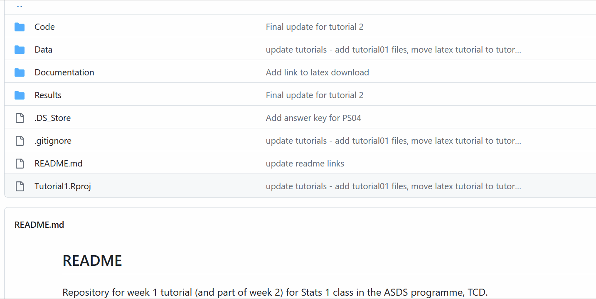
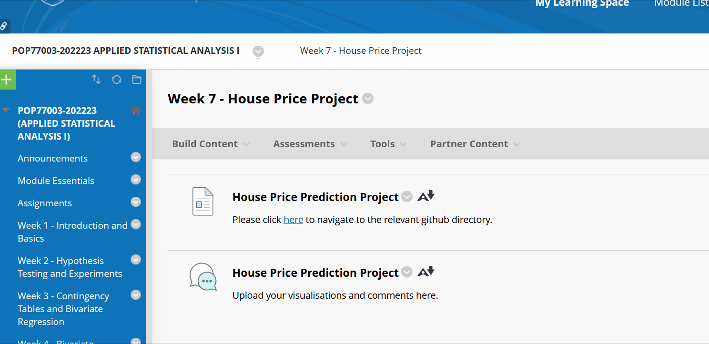

```{r setup, include=FALSE}
knitr::opts_chunk$set(echo = TRUE)
```

## Context

The [*Applied Social Data Science Programme*](https://www.tcd.ie/Political_Science/postgraduate/pg-dip-applied-social-data-science/) is a postgraduate diploma (PG Dip.) offered by the Department of Political Science and funded by the HEA's [Springboard+](https://hea.ie/skills-engagement/springboard/) initiative. The target student group for Springboard+ programmes is unemployed people with a previous history of employment, those in employment, and those returning to the workforce. In practice, approximately half of students are recent graduates. The programme is currently close to completing its second year, and will next year be offered also as a paid MSc (i.e. with additional 30 ECTS dissertation). As well as Springboard+ students, ASDS modules are also offered to Political Science PhD researchers, and the Statistics I and II modules are compulsory methods classes for first year PhD researchers.

## Need

Following year one of the programme it became clear from student feedback that teaching did not always meet expectations, particularly regarding the *retraining* and *upskilling* aspect of Springboard+ programmes. Students felt that the programme was too narrowly focussed on purely *academic* skills appropriate for PhD researchers and those wishing to proceed to a career in HE, and did not include enough focus on the broader skillset required for working in the private or public sectors as a data scientist.

A need was therefore identified to improve professionalisation, and introduce students to the wider set of techniques necessary to be competitive within the job market. These include managing the data science workflow, familiarising students with common data science platforms for collaboration, as well as the more practical coding skills needed to wrangle data and communicate results.

## Proposed Solution

To meet this need I redesigned my teaching for [**Statistics I**](https://github.com/ASDS-TCD/StatsI_Fall2022), a compulsory 10 ECTS module offered to both ASDS students and first year PhD researchers. Teaching on this 10 week module is currently divided between 2hrs per week of lectures, given by a colleague, and 2hrs per week of tutorials/labs, taught by me. In year one of the programme these tutorials were divided into two 1 hour sessions, for two groups of students.

My proposed solution involved combining the two groups into a single 2 hour class, and then using the additional time available to restructure the pedagogical approach of the tutorials to a more praxis-oriented method. Rather than treating professional skill acquisition as separate to the learning outcomes, and simply pointing students toward additional external resources, I attempted to model each tutorial around a (realistic) data science project workflow, including the systems and tools which would be necessary to complete the task.

Within this approach an emphasis was placed on *iteration*: the same processes were repeated each week, with progressive complications and technical challenges added to stretch students whilst reinforcing a mental map of data science as a set of practices.

To begin with, processes were introduced simply as workflow (i.e., without an explicit requirement to code or engage with overly technical resources); once the motivation for an approach was clear, the technical aspect of practice was then gradually introduced, until students were able to grasp both *why* and *how* certain processes were followed.

## Implementation

Implementation of the new teaching strategy involved advancing pedagogy in three specific areas: firstly, new teaching material was developed in skills for **workflow management and professionalisation**; secondly, synchronous teaching sessions were redesigned to include greater focus on **collaboration, group work and peer learning**; and finally, additional opportunities for **formative assessment and continuous feedback** were integrated into the teaching design. Each of these areas involved embedding digital pedagogy in some form.

### Workflow Management and Professionalisation

To embed good workflow practices the first five weeks of tutorials were designed as discrete mini projects. I researched online for resources by data scientists that described their own workflow in a pragmatic way, and eventually decided on the approach used by [Pat Schloss (Riffomonas)](https://www.youtube.com/@Riffomonas), a data scientist working in genetics who uses a combination of [**R Studio**](https://posit.co/products/open-source/rstudio/) with [**github**](https://github.com/) for version control and collaborative work.

In the existing teaching approach to this module students were already required to sign up to github. Github is an online repository for sharing code which makes use of [*git*](https://git-scm.com/), a version control system. Git and github are both widely used in the industry, and skill acquisition in both is thus useful for professionalisation. However, git/github were previously used only as a method for distributing and grading assignments, with no explicit instruction provided, and students thus struggled both with motivation (why) and implementation (how).

I decided therefore to explicitly integrate git and github within the weekly workflow of tutorials. Within the Statistics I *repository*, I placed each week a `tutorial` folder which was further divided into sub-folders for `code`, `data` and `results`. When students *forked* the main repository they gained access to copies of these folders on their own system, which they could then work with in R Studio. In this way, I could model students both the process needed to upload their own assignments, as well as good practice in managing future data science projects (version control, separation of code from data from results, etc.)



As the term progressed students were required each week to *update* their github repositories, an iterative process which reinforced learning and helped students understand in an intuitive way how git/github works and, more importantly, *why* data scientists use it to keep track of projects and work collaboratively. Students were also continually required to interface git/github with R Studio, another important professional requirement, as much of data science involves getting different systems to interface with each other.

Further professionalisation was encouraged through use of [R markdown](https://rmarkdown.rstudio.com/) (see below) and [`Latex`](https://www.latex-project.org/) - both forms of markdown language used to communicate results, but which require some degree of expertise to use well. Different mini projects required students to write up their results in RMD or `Latex`.

Finally, an added benefit of using git/github with RMD concerned the availability of materials: tutorial guides, written in RMD, could be published to github and viewed by students as `html` web pages. This both demonstrated to students a viable method for communicating results themselves, as well as providing a stable platform for tutorial resources which would not be limited by access to Blackboard.

### Collaboration, Group Work and Peer Learning

A typical requirement of professional data scientists is the ability to work collaboratively with colleagues, while the academic literature on teaching and learning has also identified *peer learning* as an important component of the student learning process.

In the first year of the programme few structured opportunities for collaboration were offered to students as part of their learning (synchronous or asynchronous), while spontaneous collaboration across problem sets resulted in more than one case of plagiarism, which could at least partially be explained by a lack of clear guidance to students on the extent to which collaboration was permitted, and perhaps too great a focus on individual work.

I therefore decided to incorporate a group work element within the module: as students improved their practical skills across the first five weeks of the programme, short synchronous exercises involving collaboration were worked into the tutorials. Following reading week in the middle of term, the final six classes were structured around a single, large group project, the [house price project](https://github.com/ASDS-TCD/StatsI_Fall2022/tree/main/tutorials/house_price_project).

This project involved students working in groups of four or five to find the best model to predict house prices, using a dataset taken from [Practical Statistics for Data Scientists](https://www.oreilly.com/library/view/practical-statistics-for/9781492072935/) (Bruce, Bruce and Gedeck). I had previously found this textbook to be useful for students, as it presented all the main concepts and models in a not overly-technical way.

The house price project was designed to introduce students gradually to the fundamental concept of linear regression, with additional technical aspects added each week, from modelling non-linear relationships, to diagnosing non-normal errors and outliers. By taking a practical, applied approach to these concepts (which are often taught in a very abstract, mathematically intense manner), I tried to emphasise to students an intuitive understanding of regression, and to model data science to them as a *practice*, rather than a checklist of formal models and equations.

Group work was also an opportunity for embedding digital pedagogy: students were invited to find their own approach to working collaboratively, with many deciding to set up their own github repositories, while communication of results involved students deciding whether to use RMD or `Latex`. As previously in the module, weekly tutorial guides were provided in `html` and RMD formats, with data shared to students through github.

### Formative Assessment and Continuous Feedback

The shift to group work and practical, project-oriented pedagogy also enabled greater opportunity for formative assessment and continuous feedback. In terms of embedding digital pedagogy, this is perhaps one area where there remains room for improvement: students were encouraged to upload their completed work during synchronous teaching to a Blackboard discussion board. This approach saw mixed results: students were often reluctant to share their models this way, and so I will consider alternative approaches for next year's module, including use of [Vevox](https://vevox.app/#/), which I briefly experimented with on another module later in the academic year, with positive results.

Nonetheless, the ability for students to work on problems during synchronous sessions and then discuss outcomes (rather than passively watch the instructor work through the problems) resulted in improved student engagement relative to the first year of the programme. In this respect, the doubling of tutorials in length from one to two hours allowed for more in-depth exploration of techniques; in practice, a single hour does not allow sufficient time for this kind of interactive teaching approach.

Another innovation I brought to this year's module concerned asynchronous feedback, paired with formative assessment. This related specifically to the house price project. I do not have any authority within the module for setting summative assessment, and given the significant workload placed on students I had decided not to set any asynchronous formative tasks for tutorial. However, during the house price project I did ask students to try to complete whatever they were working on in class and upload their group's results each week to the Blackboard discussion board. I found this asynchronous approach to work much better than in-class use of the discussion board, and when I also committed to provide students feedback on their uploaded material engagement improved further.



Finally, the house price project culminated in a brief group presentation at the end of term, again purely formative, but which provided students with a pressure-free opportunity to present their results and receive both peer and instructor feedback. Again, group presentations offered a further opportunity to embed digital pedagogy, as students were able to choose which technology to use in presenting to class, and the requirement to provide peer feedback allowed students to assess for themselves which technologies were best at communicating data science results.

## Student Feedback

Informal feedback from students was very favourable: having the opportunity to work collaboratively, and to engage interactively with tutorial material, was highly appreciated. The iterative approach to data science practice resulted in less negative feedback concerning skill acquisition (or lack of) for completing assignments, while the increased focus on modelling skills to students (rather than describing methods in an abstract manner) gave students an added sense of satisfaction in being able to produce high quality outputs. In general, the greater use of group work led to improved *esprit de corps* among students, and engagement (in terms of attendance in class) was higher than during the first year of the programme.

## Conclusion

This vignette has attempted to illustrate a real world example of the interaction between pedagogy and technology. In the case of the ASDS programme, the key pedagogical challenge lies precisely in teaching technology to students. During the first year of the programme, this was done in a manner that (ironically) made little use of technology itself: pedagogy was focussed on (passive) lecturing, individual problem sets, and with little emphasis on the practice-orientation of the data science profession. All necessary technical skills required to perform data science were left to the students themselves to acquire, or at least were not well-integrated within the learning outcomes.

By contrast, a more praxis-oriented teaching strategy opened up the role of technical skills to students, and a conscious focus on the acquisition of these within the learning objectives both highlighted their importance to students and provided structured opportunities to improve them in an iterative manner.

In this respect, the embedding of digital pedagogy within the teaching strategy made the acquisition of technical skills easier for students, best exemplified by the use of github. Placing material on github gave students ready access to all materials, and once students were proficient at using github the materials they had access to were also guaranteed to be up-to-date. Moreover, using github for pedagogical purposes *also* provided students with a highly useful professional skill.

This kind of positive feedback loop was a marked contrast to the first year of the programme, where github was one of the more widely disliked aspects of the programme among students. The github example demonstrates that thoughtful use of technology can transform the student experience, whereas a thoughtless use or integration of technology within the teaching strategy can, by contrast, lead to highly negative outcomes.

## A Note on R Markdown as a Pedagogical Communication Tool.

This vignette was created using `R markdown`, a modified version of the common `markdown` language designed to be used in collaboration with the [`R`](https://www.r-project.org/about.html) statistical programming language and `R Studio` integrated development environment (IDE). Advantages of RMD include the ability to integrate code and code output (plots, tables, etc.) within a single document, which can then be *knitted* to produce output in the form of `html`, PDF or MS Word documents.

Teaching *through* RMD can introduce students to important data science concepts, including the need to communicate results clearly, and to produce output which is reproducible and shareable. RMD therefore has a pedagogical value in and of itself: it can be used by the instructor to produce informative summaries to share with class and teach with, while the student who learns how to use RMD gains experience in separating and compartmentalising the data science workflow, and communicating results.

### Annotated Bibliography

[Bates, Anthony W. (2019) Teaching in a digital age: Guidelines for designing teaching and learning. BC campus, 3rd Edtn.](https://opentextbc.ca/teachinginadigitalage/)

*A practical framework for making decisions about technology use in HE teaching and learning*

[Baumer, B., Cetinkaya-Rundel, M., Bray, A., Loi, L., & Horton, N. J. (2014). R Markdown: Integrating A Reproducible Analysis Tool into Introductory Statistics. Technology Innovations in Statistics Education, 8(1).](https://arxiv.org/abs/1402.1894)

*Review of R Markdown as a pedagogical tool for teaching introductory statistics, including experiential and statistical evidence for its effectiveness*

[Bruce, P., Bruce, A., & Gedeck, P. (2020). Practical statistics for data scientists: 50+ essential concepts using R and Python. O'Reilly Media.](https://www.oreilly.com/library/view/practical-statistics-for/9781492072935/)

*Statistical handbook using R and Python to teach statistics for data scientists. I have used materials from this book to teach statistics with good results*

[Hamilton, Erica R., Joshua M. Rosenberg, and Mete Akcaoglu. (2016) "The substitution augmentation modification redefinition (SAMR) model: A critical review and suggestions for its use." TechTrends 60: 433-441.](https://link-springer-com.elib.tcd.ie/article/10.1007/s11528-016-0091-y)

*A (critical) review of the SAMR model, used to categorise technology implementation in pre-college US educational settings*

[Zagalsky, Alexey, Joseph Feliciano, Margaret-Anne Storey, Yiyun Zhao, and Weiliang Wang. (2015) "The Emergence of GitHub as a Collaborative Platform for Education." Proceedings of the 18th ACM Conference on Computer Supported Cooperative Work & Social Computing: 1906--1917.](https://dl-acm-org.elib.tcd.ie/doi/10.1145/2675133.2675284)

*Qualitative review of current use of github in educational settings as a tool for collaborative working*
